<h1 align="center">E-commerce </h1>

   

____
### 
 Tabela de Conteúdos 🗺️: 

  🔹	[Descrição do projeto](#descrição-do-projeto)  
  🔹	[Funcionalidades](#funcionalidades) 
  🔹	[Gems utilizadas](#gems-utilizadas) 
  🔹	[Como instalar a aplicação](#como-instalar-a-aplicação) 
  🔹	[Utilizando as API's](#utilizando-as-banco-d) 
  🔹	[Configurando o banco de dados](#configurando-o-banco-de-dados) 
  🔹	[Layout da aplicação](#layout-da-aplicação) 
  🔹	[Ideias para implementações futuras](#ideias-para-implementações-futuras) 

  #### 
 Descrição do projeto 

___
  Uma plataforma que permite a compra de produtos em uma loja virtual
  utilizandopagamentos através de pontos chamados Rubis, que podem ser acumulados pelas pessoas. Os Rubis são creditados na conta através de pagamentos convencionais e seu preço é dado por uma taxa de cambio flutuante.

  #### 
 Funcionalidades da aplicação 

___

  - [X] Administrador da loja consegue cadastrar produtos, categorias e subcategorias de produtos.
  - [x] Administrador da loja consegue ativar ou desativar produtos, categorias e subcategorias de produtos.
  - [X] Administrador consegue realizar o acompanhamento de pedidos.
  - [X] Administrador consegue programar valores de produtos por intervalos de datas.
  - [x] Administrador consegue cadastrar um cupom de promoção para subcategorias selecionadas com valor percentual, valor máximo em dinheiro e quantidade máxima de usos e data de expiração.
  - [X] Visitante pode ver todos os produtos, buscar produtos por categoria ou por nome e se cadastrar na plataforma.
  - [X] Cliente pode adicionar produtos ao carrinho
  - [X] Cliente pode inserir um cupom de desconto 
  - [X] Cliente pode acompanhar a situação de suas compras
  - [X] Cliente pode ver detalhes de suas compras
  - [X] Cliente pode conferir seus dados e realizar a compra de Rubis

 ##### 
 Linguagem e Gems utilizadas :gem:: 

___
- [Ruby 3.1](https://ruby-doc.org) - Linguagem utilizada
- [Rails 7.0](https://guides.rubyonrails.org) - Framerwork utilizado para desenvolver o projeto
- [Rspec](https://github.com/rspec/rspec-rails) - Utilizado para os testes da aplicação
- [Capybara](https://github.com/teamcapybara/capybara#using-capybara-with-rspec) -Auxilia o rspec durante os testes
- [Devise](https://github.com/heartcombo/devise) -	Utiliziada para gerenciamento dos usuários
- [Pry-byebug](https://github.com/deivid-rodriguez/pry-byebug) - Utilizada para debugar o código
- [Simplecov](https://github.com/simplecov-ruby/simplecov) - Utilizada para garantir que os testes cubram o máximo de código possível 
- [Shoulda-Matchers](https://github.com/thoughtbot/shoulda-matchers) - Utilizada para facilitar testes de validações de models
- [Factory-Bot](https://github.com/thoughtbot/factory_bot) - Utilizado para facilitar a criação de objetos no ambiente de testes
- [Faker](https://github.com/faker-ruby/faker-bot) - Utilizada em conjunto ao factory-bot
- [Rubocop](https://github.com/rubocop/rubocop-rails) - Utilizado para padronização de código

####  
 Como instalar a aplicação 🔌: 

___

Clone o repositório em seu computador: 

    $ git clone  https://github.com/TreinaDev/e-commerce-td08-time03.git 

######  
 Instale as dependências do projeto: 

    $ bundle install

###### Inicie o servidor:

    $ rails server

###### Rodando os testes:

    rspec

#### Configurando banco de dados 💾:
___

Execute o comando seed no seu console para popular o banco de dados:

    rails db:seed

#### Utilizando as API's 🛸:
___

 - A aplicação pode ser utilizada sem o uso da API [pagamentos](https://github.com/TreinaDev/pagamentos-td08-time03), desenvolvida por outro grupo do nosso time, mas recomendamos que ela seja utilizada em conjunto com a nossa. Veja o repositório deles para mais detalhes de uso e instalação. 
 - Nossa aplicação também possui endpoints para receber requisições, que estão disponíveis no arquivo api.md

###### Inicializando a aplicação de pagamentos:
Com a aplicação de pagamentos pronta para uso, utilizaremos ela simultâneamente com a nossa, através da porta 4000  

    $ rails server -p 4000

#### Layout da aplicação 🔭:
___
###### Como mercador:
  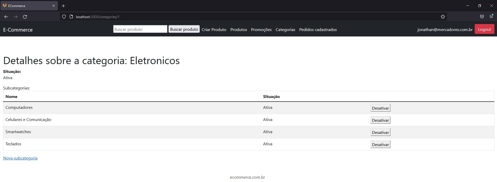
  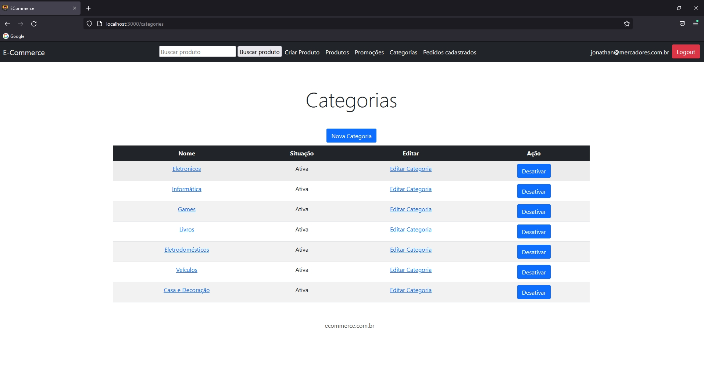
  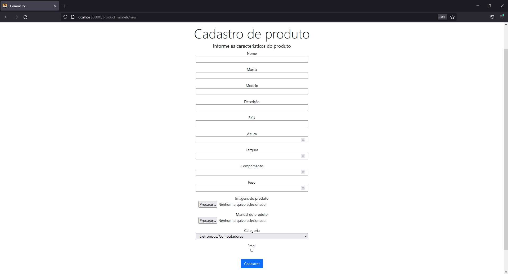
  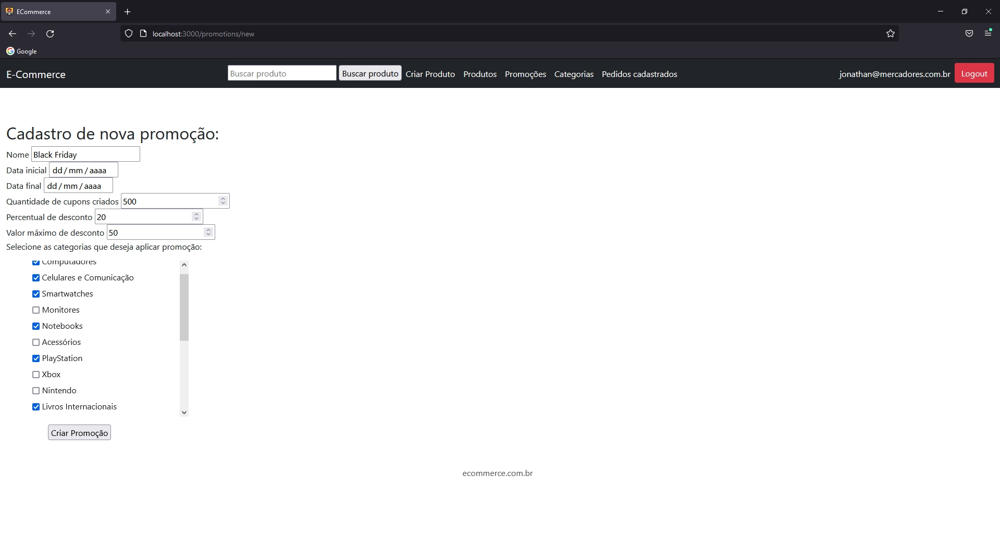
  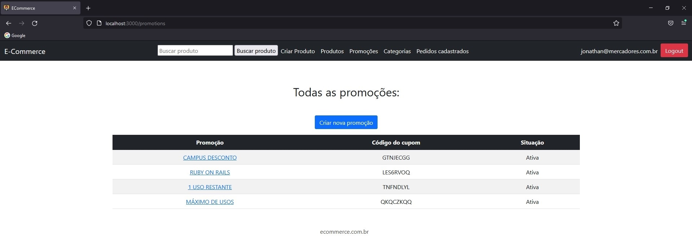 
  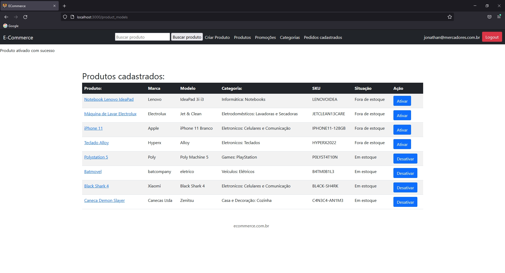
  

###### Como visitante/cliente:
  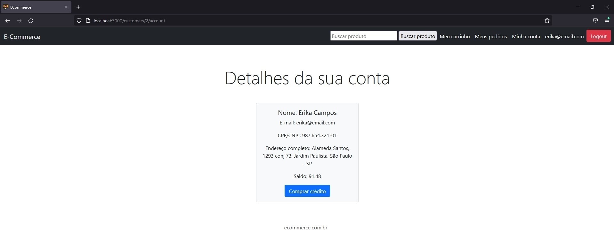
  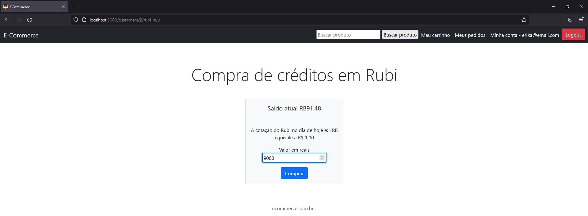
  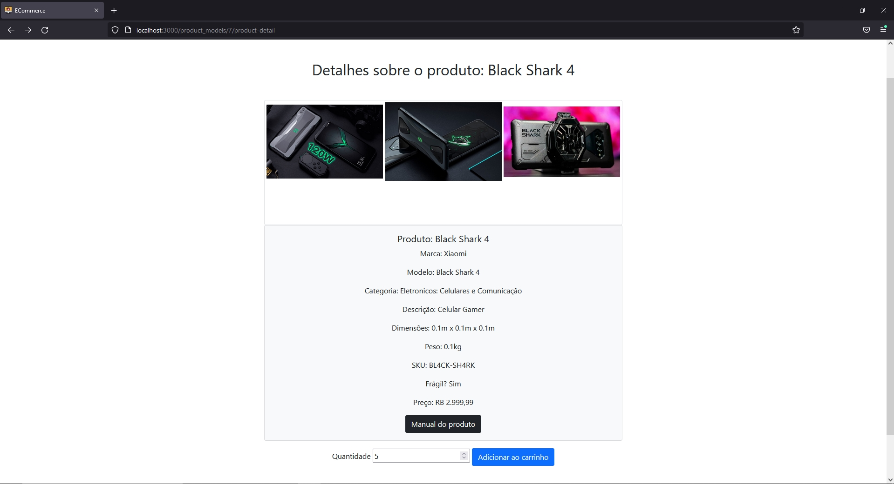
  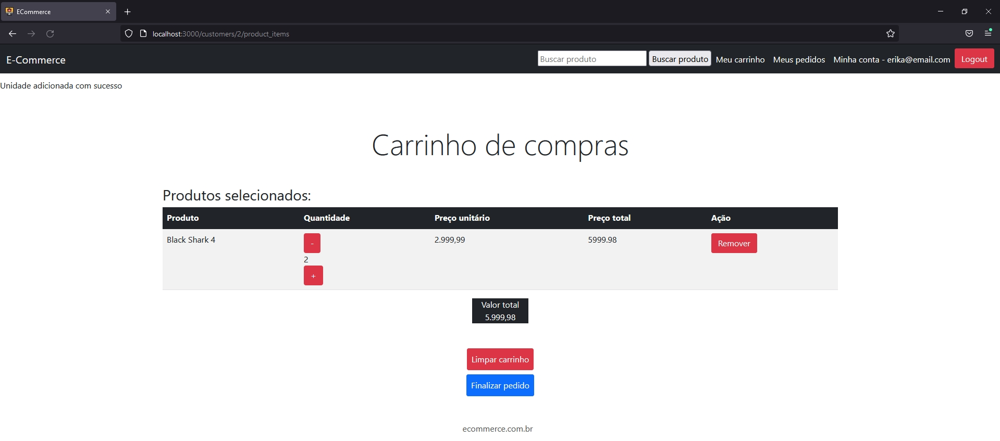
  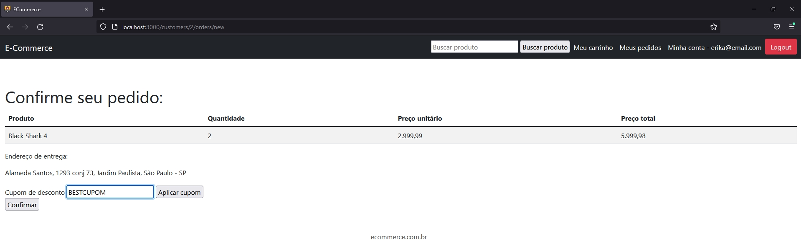

###### Páginas compartilhadas:
  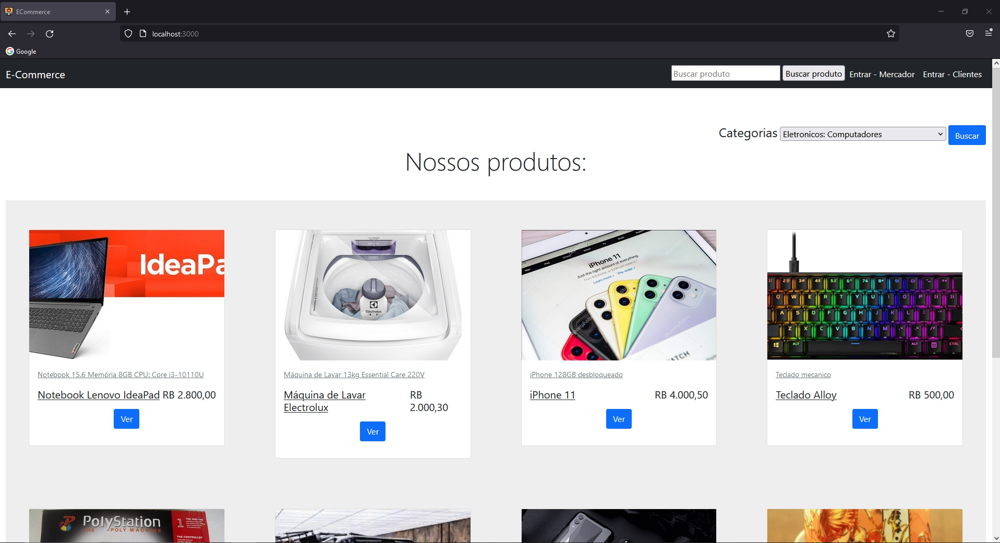
  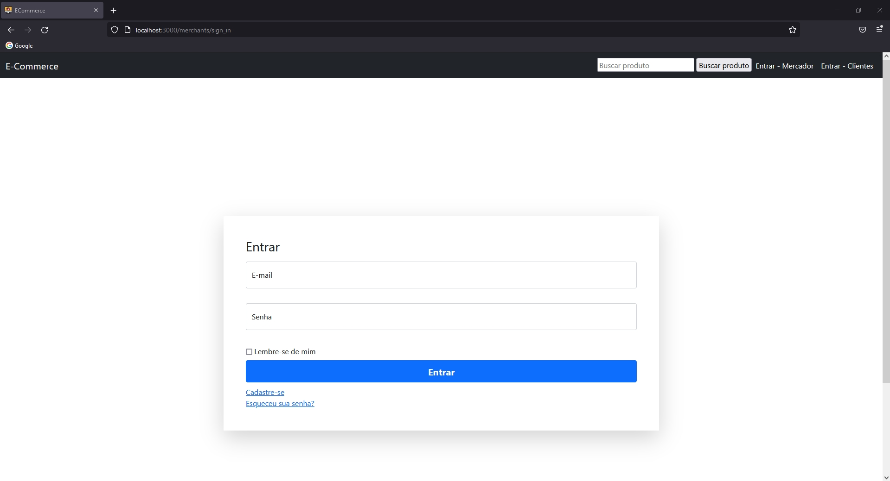
  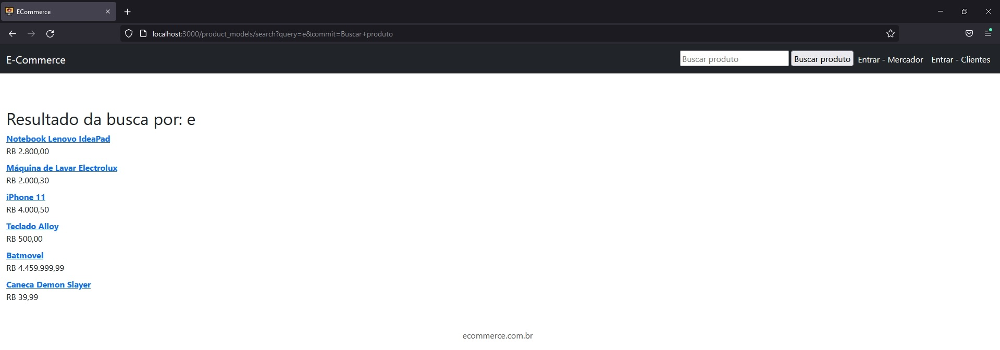

### Ideias para implementações futuras 📖:
___
* Utilização da Gem FriendlyId para urls personalizadas
* Melhorar o front-end da aplicação
* Melhoria no sistema de cupons
* Implementação sistema de cashback
* Implementação de estoque de produtos

### Contribuintes 👨‍💻👩‍💻 : 

| [ Jonathan de Oliveira Gonçalves](https://github.com/jonathandeoliveira) |  [ Raif Cerveny](https://github.com/Raifc) |  [ Margarete Freitas Martins](https://github.com/fmarga) |  [ Lucas César](https://github.com/lucascda) |
| :---: | :---: | :---: | :---: | 